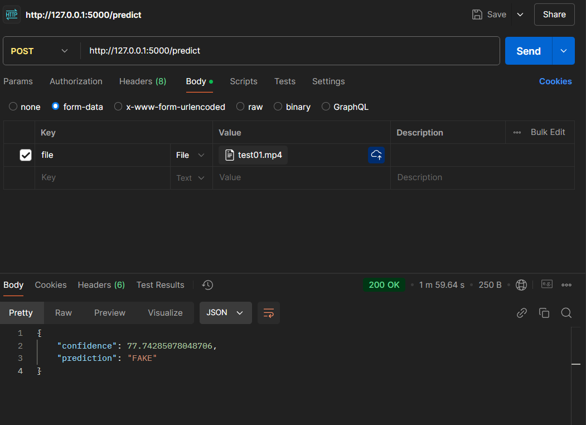

## Hướng dẫn chạy
`pip install -r requirement.txt`

- chạy file app.py thì server chạy trên http://127.0.0.1:5000
- chạy file xong thì gọi api thông qua url http://127.0.0.1:5000/predict
- kết quả trả về là json chứa kết quả "Fake" or "Real" và độ tin cậy của kết quả tính theo %

example:

## Nếu mà có lỗi dlib thì làm theo cái này

tải file tương ứng với phiên bản python trên máy, add vào project rồi chạy lệnh tương ứng như ở dưới
https://github.com/sachadee/Dlib

Dlib compiled wheels for Python 3.7, 3.8, 3.9 for Windows 10 X64
Dlib compiled binary (.whl) for python 3.7, 3.8, 3.9 for windows x64

After wasting a lot of time to get these files, I compiled them myself.

1- Download the file you need
2- copy it in the root folder of your python distribuition
3- open a cmd shell in the your root python folder

example:

cd c:\python37
4- Install dlib true PIP

python 3.7

`python -m pip install dlib-19.22.99-cp37-cp37-win_amd64.whl `

python 3.8

`python -m pip install dlib-19.22.99-cp38-cp38-win_amd64.whl`

python 3.9

`python -m pip install dlib-19.22.99-cp39-cp39-win_amd64.whl`

python 3.10

`python -m pip install dlib-19.22.99-cp310-cp310-win_amd64.whl`

python 3.11

`python -m pip install dlib-19.24.1-cp311-cp311-win_amd64.whl`

That's it
